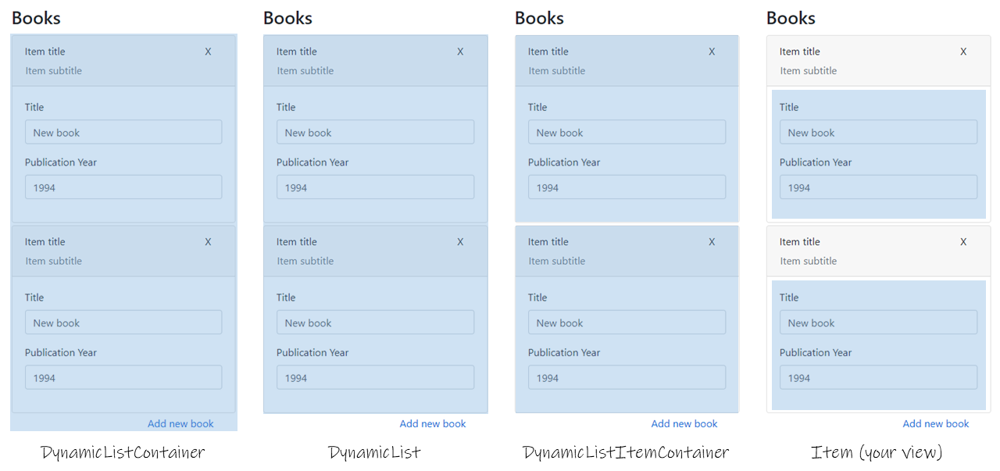

<h1 class="article-title">ynamic View-Model Lists</h1>

-------

The *Dynamic View Model Lists* library (DVML) provides a templating engine to render dynamic item lists in ASP.NET. 
A dynamic list is a list inside an HTML form where the user can add new items to a list after the page 
has been rendered.
In ASP.NET, the default model binder makes certain assumptions to determine the name of the fields in the
form and how they should be posted back to the server. Using this library, those assumptions
are always fulfilled and your forms posted correctly.

This library provides an alternative to the [EditorForMany extension](https://github.com/mattlunn/DynamicListBinding)
by [@mattalun](https://www.mattlunn.me.uk/blog/2014/08/how-to-dynamically-via-ajax-add-new-items-to-a-bound-list-model-in-asp-mvc-net/)
and [BeginCollectionItem](https://www.nuget.org/packages/BeginCollectionItem/) by [Steve Sanderson](http://blog.stevensanderson.com/2010/01/28/editing-a-variable-length-list-aspnet-mvc-2-style/).
However, it supports nested lists of any depth, does not require adding an extra Index field to
your existing models or view models, and suports multiple editor and display templates for your items.
The library can also make your controllers include [additionalViewData](https://docs.microsoft.com/en-us/dotnet/api/microsoft.aspnetcore.mvc.rendering.ihtmlhelper-1.editorfor?view=aspnetcore-3.1)
that had been specified in your view without cluttering your controller code with too many details
about the view.

In addition, the library can also handle requests sent by either GETs or POSTs.


# Getting started

To get started, start by adding a reference to the [DynamicVML NuGet package](https://www.nuget.org/packages/DynamicVML/)
in your project:

<span class="install-command">dotnet add package DynamicVML</span>

After adding the package, you just have to perform four steps to get it running:

### 1. Add script references
Add a reference to `~/lib/dynamic-viewmodel-list/dvml.js` to your view, e.g., either by adding
it to your `_Layout.cshtml` file or to the `Scripts` section usually located at the bottom of 
your `Create`, `Edit`, `Details`,  and/or `Delete.cshtml` view files:

```html
@section Scripts {
    <!-- Load JS code for the Dynamic ViewModel Lists above -->
    <script src="~/lib/dynamic-viewmodel-list/dvml.js"></script>
}
```

>[!NOTE]
The include above should work even though you will notice that this file will not be physically 
present in your `wwwroot` folder. That's because the library is implemented as a [.NET Core App 3.1 Razor
Class Library (RCL)](https://docs.microsoft.com/en-us/aspnet/core/razor-pages/ui-class?view=aspnetcore-3.1&tabs=visual-studio#create-an-rcl-with-static-assets)
and the .js is embedded within the library .DLLs. 


### 2. Replace relevant usages of List&lt;T&gt; with [DynamicList&lt;T&gt;](xref:DynamicVML.DynamicList%601)
Update your view models to use `DynamicList<T>` instead of `List<T>` for any
collections you want to support client-side dynamic insertion:

```cs
public class AuthorViewModel
{
    [Display(Name = "First name")]
    public string FirstName { get; set; }

    [Display(Name = "Last name")]
    public string LastName { get; set; }

    [Display(Name = "Authored books")]
    public virtual DynamicList<BookViewModel> Books { get; set; } = new DynamicList<BookViewModel>(); // <----
}
```


### 3. Add actions that create new items to your controllers
Add an action to your controller to create a new view model item upon request:

```cs
public IActionResult AddBook(AddNewDynamicItem parameters)
{
    var newBookViewModel = new BookViewModel()
    {
        Title = "New book"
    };
           
    return this.PartialView(newBookViewModel, parameters);
}
```


### 4. Use ListEditorFor() and DisplayListFor() in your views
Update your view to use a the extension method `Html.ListEditorFor()` method that takes
the name of the method above and a text to be rendered as the *"add new item"* button as an 
argument:

```html
<div>
    <h3>Books</h3>
    @Html.ListEditorFor(x => x.Books, Url.Action("AddBook"), "Add new book")
</div>
```


# Features

The library provides a templating mechanism and an *options* mechanism so you can 
customize your lists without having to perform too many changes to your existing 
view models.

### Using templates to customize list rendering

The library assumes that you already have defined reusable views for the many multiple view models 
you might have in your project. For example, a common approach for reuse would be to define a common
"Address.cshtml" view that could render an `AddressViewModel` in different sections of your application.

With this assumption in mind, it would have been a lot of trouble if you had to create separate
views for each common kind of list items you would like to add to your project, e.g., lists for `PhoneViewModel`s,
`AddressViewModel`s and so on.
That is why, using this library, you can specify which template view you would like to use for each part
of the list directly when creating your view. For instance, let's say you would like to render a list of
`AddressViewModel`s with one layout, and a list of `PhoneViewModel`s with a different layout. Then you
could use:

```cs
@Html.ListEditorFor(x => x.Addresses, Url.Action("AddAddress"), "Add new address",
    listContainerTemplate: "CustomListContainerTemplateWithBellsAndWhistles") 
```
or
```cs
@Html.ListEditorFor(x => x.Phones, Url.Action("AddPhone"), "Add new phone",
    listContainerTemplate: "CustomListContainerTemplateWithFancyButton") 
```

Now, note that the list templates do not have any knowledge of your view models. They are completely
reusable for different regions of your application, with any ViewModel you would like to use. 

>[!NOTE]
The library can guess common names for the view, the action, and even the *"add new item"* texts
from the name of your ViewModel, so they do not really need to be specified when calling `Html.ListEditorFor()`.
However, specifying the view is strongly advised in order to avoid unnecessary server-side processing.

The library assumes dynamic lists are composed of four main (fully customizable) regions:

- A region that contains the list (*which the library refers to as DynamicListContainers*)
- The list (*which the library refers to as DynamicList*)
- Regions that contain the list items (*which the library refers to as DynamicItemContainers*)
- The list items (*which are your already existing views*)

The meaning of each region is shown in the figure below:



Note that each of those regions are completely oblivious of each other and can be replaced at will,
without having to create different views for each configuration. All you have to do is specify templates
for them when calling `ListEditorFor()` in your view. If you do not specify the template for some region,
the library will use default ones that can be obtained either from the library itself, or by searching
for .cshtml files in your application that have the same name as the default templates.


### Custom reusable options

Now, a common task is to be able to customize each of the item containers with some buttons (e.g. to
remove the item, collapse the item, or display extra information about what the user is entering).
Furthermore, you may want only some items to be removable, but not all of them (e.g. the first
address in a list of addresses could be mandatory and non-removable).

Instead of having to add each of those options to your ViewModels and thus maybe having multiple
different ViewModels for different configurations of your items, you can instead specify *item
options* for each of your items directly from your view or controller:

```cs
public IActionResult AddBook(AddNewDynamicItem parameters)
{
    var newBookViewModel = new BookViewModel()
    {
        Title = "New book",
        PublicationYear = "1994"
    };

    return this.PartialView(newBookViewModel, parameters, new MyOptions<BookViewModel>()
    {
        CardTitle = "Dynamic item",
        CardSubtitle = "You cannot remove this item",
        CanRemove = false
    });
}
```

The `MyOptions<T>` can be considered a separate view model on its own, that you can customize 
yourself, adding any options you may want, e.g.:

```cs
public class MyOptions<T> : DynamicListItemOptions<T>, IMyOptions
    where T : class
{
    public string CardTitle { get; set; }
    public string CardSubtitle { get; set; }
    public bool CanRemove { get; set; }
}
```

As you can see, this mechanism is highly useful for using with front-end frameworks
like Bootstrap (where you could bind the CardTitle and CardSubtitle to
[Bootstrap Cards](https://getbootstrap.com/docs/4.0/components/card/)),
without adding strong coupling with a particular framework. The view for your options
and the both the view and the view models for your entities are completely independent 
from your `MyOptions<T>` ViewModel.


### Avoid touching the view at all

Instead of specifying each of your views to add the extra parameters to `ListEditorFor()`,
you can alternatively configure the DynamicList properties of your view models directly
in your view model class definition using attributes:

```cs
public class AuthorViewModel
{
    public string FirstName { get; set; }
    public string LastName { get; set; }

    [Display(Name = "Authored books")]
    [DynamicList("BookView", 
        ItemContainerTemplate = "MyCustomItemContainer", 
        ListTemplate = "MyCustomList",
        Method = RequestNewItemMethod.Post)]
    public virtual DynamicList<BookViewModel> Books { get; set; } = new DynamicList<BookViewModel>();
}
```

>[!NOTE]
While this is possible, this is not exactly recommended as one could argue that specifying view 
parameters in your view models may add unnecessary coupling between your code and the presentation
layer. However, if you **really** want to do this, the library will let you do so.


### Passing custom *additionalViewData* to dynamic list items

Maybe in your project you might have the need to pass different parameters to your views
by passing anonymous objects to the `additionalViewData` parameter of `ListEditorFor()`. However,
when a user requests a new list item to be added to the form, it is the controller's task to
create a new partial view to be sent to the client, and the additionalViewData you have specified
in the creation of the view will not be available from the controller's side.

In order to address this situation, the library can serialize your custom objects into
JSON UTF-8 byte arrays and keep them hidden in the HTML of the form at the client side. When
the user requests a new item, the ajax call to the server will include the serialized
additional data that will then be passed seamlessy to the new partial view, keeping the
original behavior of your views working. 

```cs
@Html.ListEditorFor(x => x.Phones, Url.Action("AddPhone"), "Add new phone",
    method: RequestNewItemMethod.Post,
    additionalViewData: new {
        MyCustomData = "some attribute I can only compute from the view"
    }) 
```

>[!Note]
Passing additional view data to the client requires also specifying `method: RequestNewItemMethod.Post`
since the additional data may be too long to be included in a GET query string.

>[!WARNING]
While the library supports this scenario, it may not be advisable to actually make use of this
since there may be other cleaner ways to pass user data to your views, e.g. with proper properties
in your view models. A malicious user could also tamper with the stored data and let the form
submit altered data to your server. However, again, if you **really** need this functionality and
understand the risks, the library will also let you do so.


# Related links

### Alternative approaches &amp; more information on ASP.NET's binding mechanism:

 - https://www.mattlunn.me.uk/blog/2014/08/how-to-dynamically-via-ajax-add-new-items-to-a-bound-list-model-in-asp-mvc-net/
 - http://blog.stevensanderson.com/2010/01/28/editing-a-variable-length-list-aspnet-mvc-2-style/
 - https://tuanmsp.wordpress.com/2017/04/25/aspnet-editorfor-with-list-and-add-more-item-to-list-with-ajax/
 - https://dapper-tutorial.net/knowledge-base/53601008/dynamic-add-and-edit-of-data-in-asp-net-mvc-using-razor-view
 - https://blog.rsuter.com/asp-net-mvc-how-to-implement-an-edit-form-for-an-entity-with-a-sortable-child-collection/


### StackOverflow questions this library should address:

 - https://stackoverflow.com/questions/14038392/editorfor-ienumerablet-with-templatename
 - https://stackoverflow.com/questions/36171865/dynamic-partial-view-list-not-being-picked-up-when-saving
 - https://stackoverflow.com/questions/52305337/how-do-i-use-the-editorformany-html-helper-in-net-core
 - https://stackoverflow.com/questions/42116800/editorformany-not-working-for-objects-deeper-than-1-level
 - https://stackoverflow.com/questions/29324837/add-related-entities-with-asp-net-mvc-and-razor
 - https://stackoverflow.com/questions/9915612/how-can-i-add-rows-to-a-collection-list-in-my-model


# License

This library is licensed under the [MIT license](https://opensource.org/licenses/MIT). The library logo 
is based on the *fa-stream* icon from [Font Awesome](https://fontawesome.com/) and is licensed under the 
[Creative Commons Attribution 4.0 International license](https://fontawesome.com/license). 